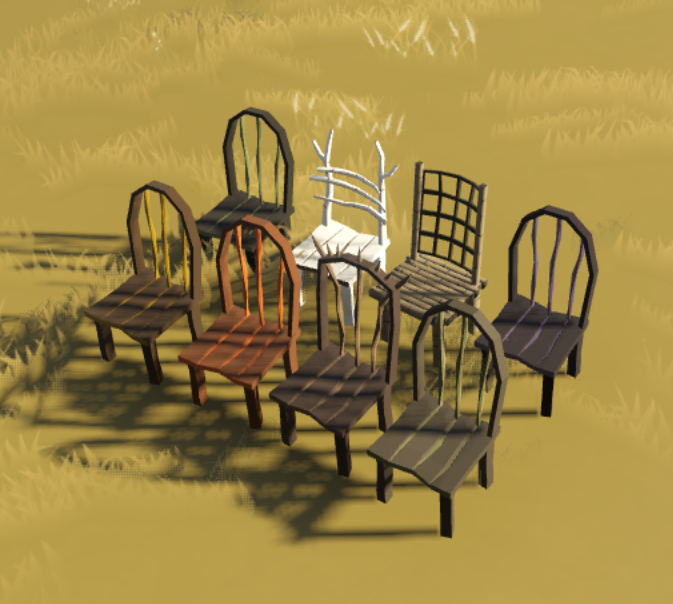

# Sapiens: Furniture Mod

Furniture is an 'Expansion Mod' for [Sapiens](https://www.playsapiens.com/), which introduces a collection of wooden chairs. All chairs are fully functional, meaning they can be sat in by Sapiens, and provide a small mood
boost, just like the base-game seating pptions. The chairs are styled depending on the wood used.

- [STEAM LINK](https://steamcommunity.com/sharedfiles/filedetails/?id=2966227716)

## Using the Mod

- This mod requires [Hammerstone Framework](https://steamcommunity.com/sharedfiles/filedetails/?id=2840825226).
- [Join the discord for Support.](https://discord.gg/WnN8hj2Fyg)

# Contents

## Wood Stock

To craft chairs, you first need to refine wood into 'Wood Stock' which is a stand-in for refined wood products. Wood Stock can be crafted at a normal crafting station, using the 'Woodworking' skill, and a scraping tool.

Here are the recipes:

- Branch x1 = Wood Stock x1
- Log x1 = Wood Stock x3

## Chairs/Building

Once you have some Wood Stock available, you can place the chairs. This requires the 'Wood Building' skill, as well as Wood Stock x6

After placing, your sapiens will enjoy to sit in the chairs. They have the highest comfort in the game, which will give your sapiens a good mood, and improve the happiness of your tribe.

### Variations

There are various material/model variations for the chairs, depending on the wood type you used to create the stock. Experiment!

# Changelog

## 1.4.0

- Adds Refined Stone resource, similar to Wood Stock
- Adds statues which use the new Refined Stone resource (alpaca, chicken, mammoth)

## 1.4.0

- Add well

## 1.3.0

- Added new 'Cloth Door' buildable
- Adjusted color schemes for colors

## 1.2.1

- Fixes issue where fired bowls were not returned when using dye on cloth

## 1.2.0

- Adds new 'dye' recipe, which can be crafted from fired bowl and various colorful pigments
- Adds new 'cloth' recipe, which can be crafted from woolskins
- Adds new 'dyed cloth' system, which allows combining cloth and dye together
- Adds new 'carpet' buildable, which can be built from four cloth sections, of assorted colors.

## 1.1.0

- Fixes issue which caused game-crashes

## 1.0.0

The first [release](https://github.com/SirLich/sapiens-furniture/releases/tag/1.0.0) of furniture really just contains chairs. More to come!
